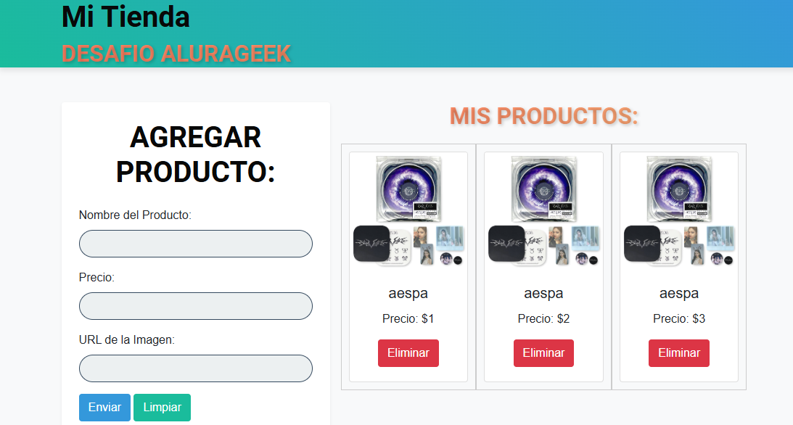

<h1 align="center"> ALURAGEEK </h1>
<h2>Descripción del proyecto</h2>

Proyecto para el curso de Alura Latam: One-Oracle Next Education

El proyecto es el desarrollo de una página que permite ingresar productos (Nombre, percio e imagen) y posteriormente su visualización. 

<h2>Estado del proyecto</h2>

El proyecto ya se encuentra culminado, totalmente funcional, pero abierto a cambios estéticos que no afectan la funcionalidad

<h2>Características</h2>

La página se desarrolla para demostrar el manejo de conceptos de Javascript como programación asíncrona, solicitudes HTTP, validación de formularios, manipulación del DOM, entre otros.

Imágen de la página

